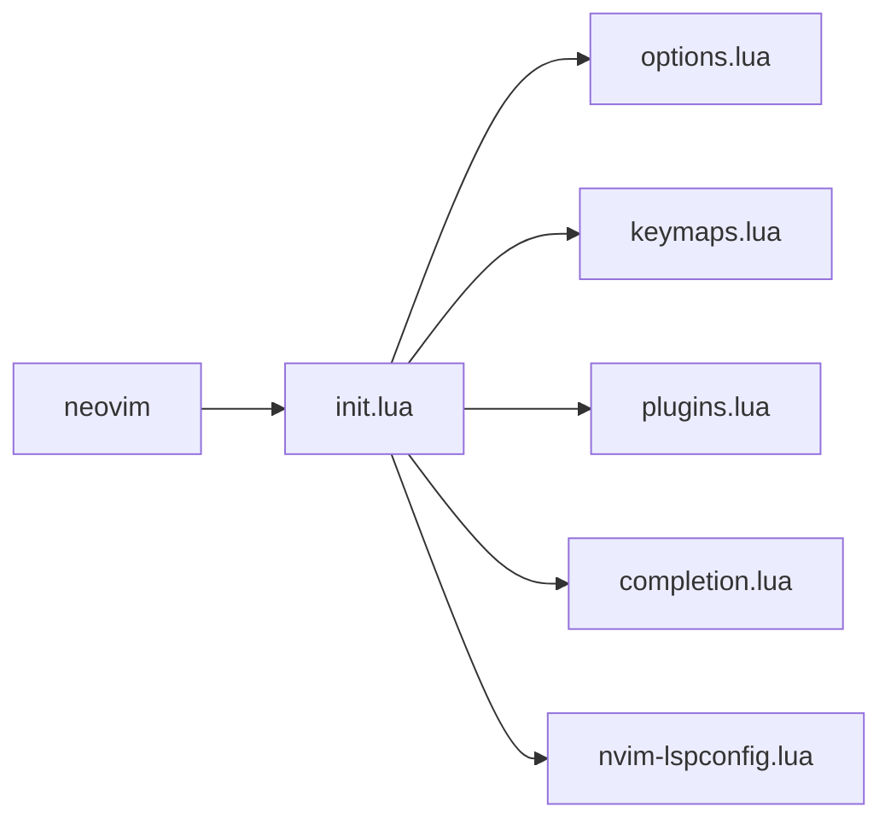

# nvim-config

Personal neovim configuration

## Goals
- Beautiful coding interface
- Simple and easy to configure
- One language for plugins and configuration
- Minimal use of plugins
- Straight forward plugin management
- Run really fast

## Features
- Organized configuration structure
- Commented configuration files
- 100% lua configuration and plugins
- Code highlighting
- Fuzzy finder
- Autocompletion and LSP
- Code snippets
- Git features (changes, blame, etc)

## Install
Neovim configuration files are placed under the directory:

`$HOME/.config/nvim`

## configuration structure

## Plugin list

#### Plugin installer
- lazy
 
#### Code highlighting
- treesitter
 
#### Fuzzy finder
- telescope
 
#### Autocomplete and LSP
- nvim-lspconfig
- lspkind
- cmp-nvim-lsp
- cmp-buffer
- cmp-path
- cmp-cmdline
- nvim-cmp

#### Code snippets
- LuaSnip
- friendly-snippets

#### Git features
- neogit
- gitsigns

#### Editor appearance
- lualine

#### QoL improvements
- nvim-tree
- nvim-autopairs
- indent-o-matic

