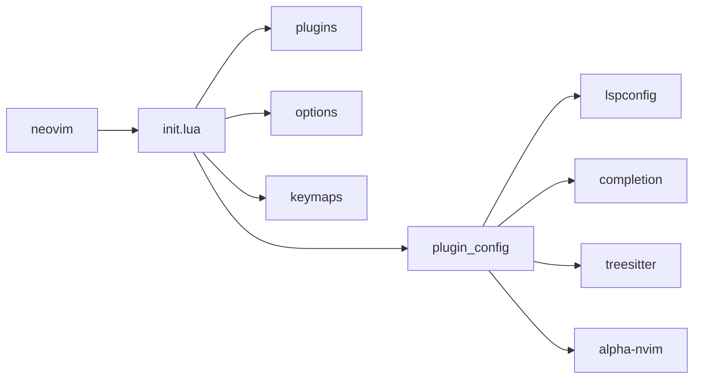

# nvim-config

Personal neovim configuration

## Goals
- Beautiful coding interface
- Run really fast
- Simple and easy to configure
- One language for configuration and plugins
- Minimal use of plugins
- Straight forward plugin management

## Features
- Organized configuration structure
- Commented configuration files
- Modern plugin manager
- 100% lua configuration and plugins
- Code highlighting and treesitter
- Fuzzy finder
- Autocompletion and LSP
- Code snippets
- Git features (changes, blame, etc)

## Install
Neovim configuration files are generally placed under the directory:

`$HOME/.config/nvim`

To clone the contents of this repository to that directory use the following command:

```sh
git clone https://github.com/jpnt/nvim-config.git $HOME/.config/nvim --depth=1
```

## Configuration structure
The following diagram represents how the configuration is arranged:



## Plugin list

The set of plugins can be seen at lua/plugins.lua

## Treesitter errors after updating plugins through Lazy

Try the following commands to fix the issue:

`:TSUpdate`

`:TSUpdateSync`
